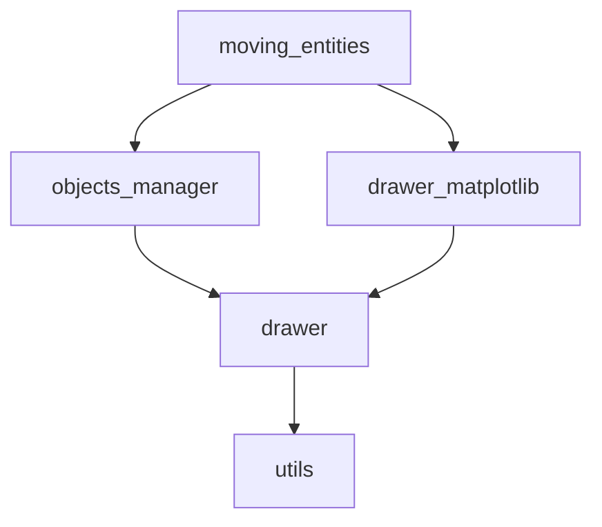

# 概観

ものを動かす範囲まで実装した。

## モジュールの説明

### 依存関係

依存関係は以下の通り。

### 各モジュールの機能

各モジュールは以下の通り。

- **moving_entities**
  - 全体を統合する
- **objects_manager**
  - entityやnutritionなどを管轄する
- **drawer**
  - 描画を行う
  - **drawer_matplotlib**
    - matplotlibを用いて描画を行う
- **utils**
  - 雑多

## オブジェクトの説明

### entity

動くもの

#### 行動指針

- 何も発見していない場合（視野長以内にnutritionがない場合）にはランダムに移動する。
- nutritionを発見し、それが視野角(一律180度; $\cos\theta>=0$ )内であればその方向に移動する
  - 非常に近い位置に存在する場合 (`close_sight`, 視野長×0.25 )は、視野方向に関わらずその方向に移動する。

### nutrition

栄養、動かない