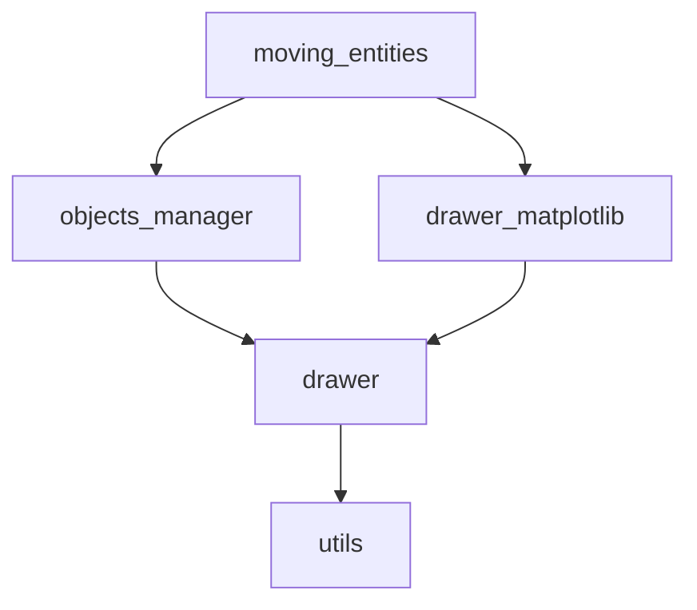
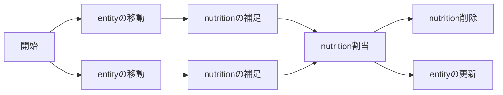

# 概観

ものを動かす範囲まで実装した。

## 目次

- [概観](#概観)
  - [目次](#目次)
  - [作成上の注意](#作成上の注意)
    - [object\_manager.py](#object_managerpy)
  - [モジュールの説明](#モジュールの説明)
    - [依存関係](#依存関係)
    - [各モジュールの機能](#各モジュールの機能)
  - [オブジェクトの説明](#オブジェクトの説明)
    - [entity](#entity)
      - [行動指針](#行動指針)
    - [nutrition](#nutrition)
  - [TODO](#todo)
  - [アルゴリズム](#アルゴリズム)
    - [概観](#概観-1)
    - [栄養の捕食](#栄養の捕食)
      - [nutritonの削除](#nutritonの削除)
    - [entityの繁殖](#entityの繁殖)
    - [チャンク](#チャンク)
      - [移動](#移動)

## 作成上の注意

### object_manager.py

- `entity`に関する何らかの追加を行う場合は、`__init__()`, `add_entity()`, `remove_entities()`への配列の登録を必ず行う。

## モジュールの説明

### 依存関係

依存関係は以下の通り。

### 各モジュールの機能

各モジュールは以下の通り。

- **moving_entities**
  - 全体を統合する
- **objects_manager**
  - entityやnutritionなどを管轄する
- **drawer**
  - 描画を行う
  - **drawer_matplotlib**
    - matplotlibを用いて描画を行う
- **utils**
  - 雑多

## オブジェクトの説明

### entity

動くもの

#### 行動指針

- 何も発見していない場合（視野長以内にnutritionがない場合）にはランダムに移動する。
- nutritionを発見し、それが視野角(一律180度; $\cos\theta>=0$ )内であればその方向に移動する
  - 非常に近い位置に存在する場合 (`close_sight`, 視野長×0.25 )は、視野方向に関わらずその方向に移動する。
- 基礎代謝: （とりあえず）静止時に400ターンで-100(HP)、移動速度に対する比率: 速度2で100ターン動き続けて-100(HP)

### nutrition

栄養、動かない、小さい

## TODO

- [x] 栄養を捕食できるようにする
  - 体長もしくは手長などを変数として保持しておき、栄養がその範囲に入った場合はこれを捕食する（[アルゴリズム](#栄養の捕食)）
- [x] 領域をチャンクに分ける。
  - すべてのEntityの最大視界長よりもチャンクの横幅を大きくする
  - [ ] Entityはモノの認識の際に、自身の属するチャンク+周辺のチャンクに存在するモノのみを判定対象とする
    - 周辺3x3チャンクでもよいし、視界方向の6とか4チャンクでもいいかもしれない
- [x] 地形（または気候）を作成する
  - [x] 気候ごとにnutritionの初期生成量を変化させる
    - [ ] 気候要因をいくつか与えるなどして、それにより生成量を変化させる
- [ ] nutritionの自動生成を行うようにする
  - [ ] 気候ごとにnutritionの生成量を変化させる
- [x] Entityの体力を設定
  - [x] `feed_entity()`の内部実装
  - [x] 移動時に体力を減少、静止していても体力が減少するように
    - [ ] 基礎代謝の減少分を別の関数に分離する
  - [ ] 方向転換で体力を減少させる
  - [ ] 速度を上昇させる際に体力を減少させる
  - [ ] 体力が減少すると移動が遅くなるor移動できなくなるようにする
  - [x] 体力が0以下になった場合は除去する
    - [x] 除去された場合にnutritionをばらまく
- [ ] entityの繁殖を可能にする（[アルゴリズム](#entityの繁殖)）
  - [ ] 「大きい」entityほど繁殖にコストがかかるようにする(EPだけでなく時間とか)
- [ ] entityに年齢を導入する
  - [ ] 年齢が一定値に達したentityを除去する
    - [ ] 「大きい」entityほど寿命を長くする(最大HPとか？)
- [ ] ゲノムの導入
  - [ ] `ENTITY_TYPES`のvalueを一意に生成するkeyをゲノムとする（keyの組から決める(ベクトル等?)）。近い値ほど近いゲノムとなるように
  - [ ] `ENTITY_TYPES`のキーからゲノムを生成する関数を作成する
  - [ ] ゲノムからentityは一意に作成できるようにする。
  - [ ] ゲノムの値に従いentityの色を変更するようにする
- [ ] 病気の導入
  - [ ] 感染はゲノム、近さ、HP、EPに基づくようにする
- [ ] `move_entity_for_nutrition()`内のclose_sightとmaxvelocityを外に出す
- [ ] ランダムウォークでふらつき過ぎる点を改善する
  - ターゲットを変更するか否かを確率(&変数)で決定する
  - [ ] ターゲットを変更しない場合に、現在のターゲットに基づき移動方向を決定する`move_entity_for_current_target(self, idx)`を実装する
  - [ ] そもそも複数のentityがいる場合にそれぞれが自身に最も近いものを検索出来ているかを検証する。`update_nutrition()`で、対象となっているnutritionのidxを見る?
    - [ ] できてないわけじゃないっぽいけど、選択される対象が決まりすぎているように感じる。選択時（`move...for_nutrition`）のロジックを少々変更したい
- [ ] 時間計測の`Timer`クラスなどを作成、各段階に設置する

## アルゴリズム

### 概観

### 栄養の捕食

`entities_attack_dist`に手長のリストを保持する。視界にエンティティが入っていることを前提として、そのエンティティとの距離(の2乗)のリスト`ntoo`を与える。（すなわち、`move_entity_for_nutrition`が`True`を返した場合にのみ処理を行う。）

手長範囲内にある場合（`ntoo<=np.square(entities_attack_dir[idx])`）、その内最も近いものを対象とする（もしくは`move_entity_for_nutrition`で移動対象としたもの（をなんらかの手段で取得し、）の距離が手帳以下である場合はそれを対象とする）。対象を捉えた場合、対象のnutritionを削除する。

#### nutritonの削除

各エンティティが補足したnutritionの`idx`をリストとして保持しておき、各エンティティがどのnutritionを獲得できるかを判定する。2エンティティの場合フローは次のようになる。

### entityの繁殖

単為生殖と有性生殖の2パターン考えられる。いずれの場合も生殖など用の`entities_extra_pt`（以下**EP**）Eを使用する。

単為生殖の場合はEPが100（または自身の体力と同等分）たまった場合に、自身のコピーを自身を中心とした2x2の範囲に配置する。

有性生殖の場合、`entities_sex`を用意し、値の違うものが近くに存在した場合に繁殖を行えるようにする。繁殖においては、親の値を引き継ぐこと、ある程度突然変異を設けること、

どちらも繁殖における追加条件を設けることも意味があると思われる。例えば繁殖可能なHPの最低値であるとか、年齢を導入して年齢の条件を設けるとか。

### チャンク

各チャンクは正方形とし、`chunk_width`(初期値20)に従い全体を分割する。計算のめんどくささなどから、全体の縦横幅は、`chunk_width`の整数倍とする。チャンクの役割は下記など

- entityの補足処理を高速化する
- 気候情報の保持（・処理）を行う
  - nutritionの自然沸き処理を行う

`(X_MIN,X_MAX) = (Y_MIN,Y_MAX) = (0,100)`、チャンク幅20の場合、 $x$ 軸は `[[0,20],[20,40],[40,60],[60,80],[80,100]]`の領域の組から、 $y$ 軸も同じく5領域の組から選定され $5\times5=25$ のチャンクに分割される。分割されたチャンクは `tuple[tuple[TmpChunkClass]]`型の変数に保存される（`TmpChunkClass`は何らかのチャンク用クラスの実装）。

オブジェクトはすべて~~チャンクインスタンス内に保持~~ワールド側が保持するとして、移動、死亡などはどのように実装するかを考える。おそらく、オブジェクトがチャンクをまたいで移動するためには、全オブジェクトのidによる管理が最も手っ取り早いのではないかと思う。

チャンク側がオブジェクトを管理しない場合、チャンクが取り扱うのは土地などに関する処理（バイオームとかパーティクルの発生とか）だろうか。もはやチャンククラスを用いずに、チャンクid（`int`）`ndarray`で管理して、処理の際に`np.where`を使用した方がよいのではないか。これを前提に処理を考える。

entityがどのチャンクにいるかは`entities_chunks: np.ndarray[int]`で管理する。（`ndarray`を用いた高速化はおそらくentityの補足処理にしか用いない気がするので）チャンクの情報は`Chunk`クラスで保持する。`Chunk`クラスは`Chunks:list[Chunk]`

参考：　[パーリンノイズ](https://postd.cc/understanding-perlin-noise/)

#### 移動

entityなどが移動する際は、
