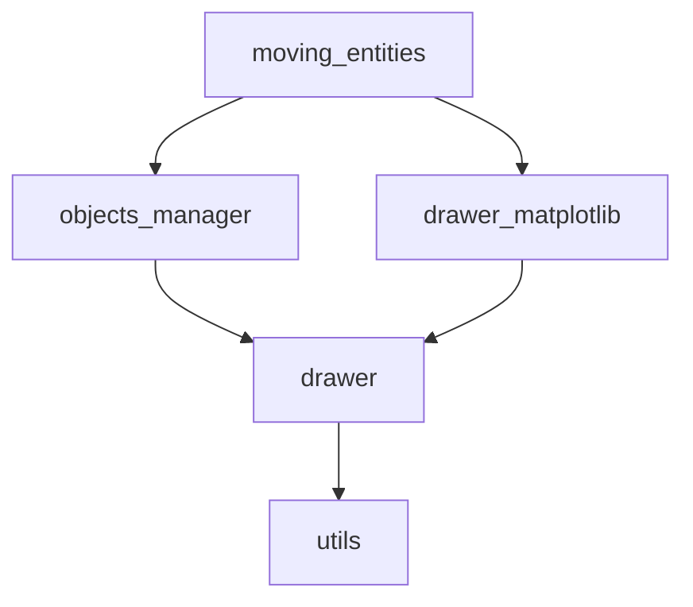
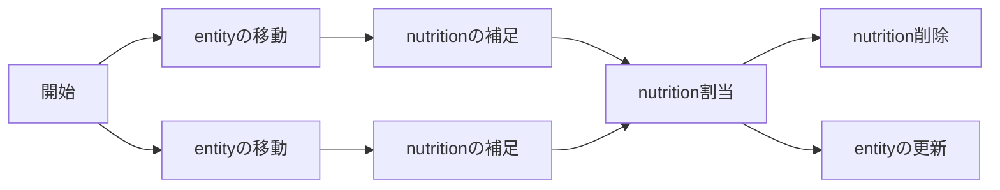

# 概観

ものを動かす範囲まで実装した。

## 目次

- [概観](#概観)
  - [目次](#目次)
  - [モジュールの説明](#モジュールの説明)
    - [依存関係](#依存関係)
    - [各モジュールの機能](#各モジュールの機能)
  - [オブジェクトの説明](#オブジェクトの説明)
    - [entity](#entity)
      - [行動指針](#行動指針)
    - [nutrition](#nutrition)
  - [TODO](#todo)
  - [アルゴリズム](#アルゴリズム)
    - [栄養の捕食](#栄養の捕食)
      - [nutritonの削除](#nutritonの削除)

## モジュールの説明

### 依存関係

依存関係は以下の通り。

### 各モジュールの機能

各モジュールは以下の通り。

- **moving_entities**
  - 全体を統合する
- **objects_manager**
  - entityやnutritionなどを管轄する
- **drawer**
  - 描画を行う
  - **drawer_matplotlib**
    - matplotlibを用いて描画を行う
- **utils**
  - 雑多

## オブジェクトの説明

### entity

動くもの

#### 行動指針

- 何も発見していない場合（視野長以内にnutritionがない場合）にはランダムに移動する。
- nutritionを発見し、それが視野角(一律180度; $\cos\theta>=0$ )内であればその方向に移動する
  - 非常に近い位置に存在する場合 (`close_sight`, 視野長×0.25 )は、視野方向に関わらずその方向に移動する。

### nutrition

栄養、動かない、小さい

## TODO

- [x] 栄養を捕食できるようにする
  - 体長もしくは手長などを変数として保持しておき、栄養がその範囲に入った場合はこれを捕食する
- [ ] 領域をチャンクに分ける。
  - すべてのEntityの最大視界長よりもチャンクの横幅を大きくする
  - Entityはモノの認識の際に、自身の属するチャンク+周辺のチャンクに存在するモノのみを判定対象とする
    - 周辺3x3チャンクでもよいし、視界方向の6とか4チャンクでもいいかもしれない
- [ ] Entityの体力を設定
  - [ ] `feed_entity()`の内部実装
  - [ ] 移動時に体力を減少
  - [ ] 方向転換などで体力を減少させる
- [ ] `move_entity_for_nutrition()`内のclose_sightとmaxvelocityを外に出す

## アルゴリズム

### 栄養の捕食

`entities_attack_dist`に手長のリストを保持する。視界にエンティティが入っていることを前提として、そのエンティティとの距離(の2乗)のリスト`ntoo`を与える。（すなわち、`move_entity_for_nutrition`が`True`を返した場合にのみ処理を行う。）

手長範囲内にある場合（`ntoo<=np.square(entities_attack_dir[idx])`）、その内最も近いものを対象とする（もしくは`move_entity_for_nutrition`で移動対象としたもの（をなんらかの手段で取得し、）の距離が手帳以下である場合はそれを対象とする）。対象を捉えた場合、対象のnutritionを削除する。

#### nutritonの削除

各エンティティが補足したnutritionの`idx`をリストとして保持しておき、各エンティティがどのnutritionを獲得できるかを判定する。2エンティティの場合フローは次のようになる。

